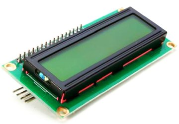

# i2cLCD1602

makecode I2C LCD1602 package for micro:bit  

## usage

open your microbit makecode project, in Add Package, paste  

"https://github.com/microbit-makecode-packages/i2cLCD1602"  

to search box then search.

## TODO

- [ ] Add a reference for your blocks here
- [ ] Turn on your automated build on https://travis-ci.org
- [ ] Use "pxt bump" to create a tagged release on GitHub
- [ ] Get your package reviewed and approved https://makecode.microbit.org/packages/approval

## License

MIT

## Supported targets

* for PXT/microbit

[From microbit/micropython Chinese community](http://www.micropython.org.cn)
